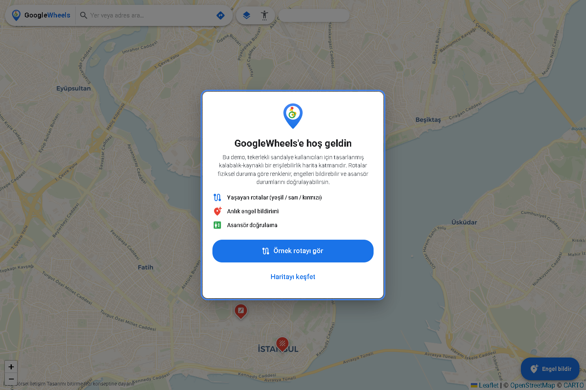
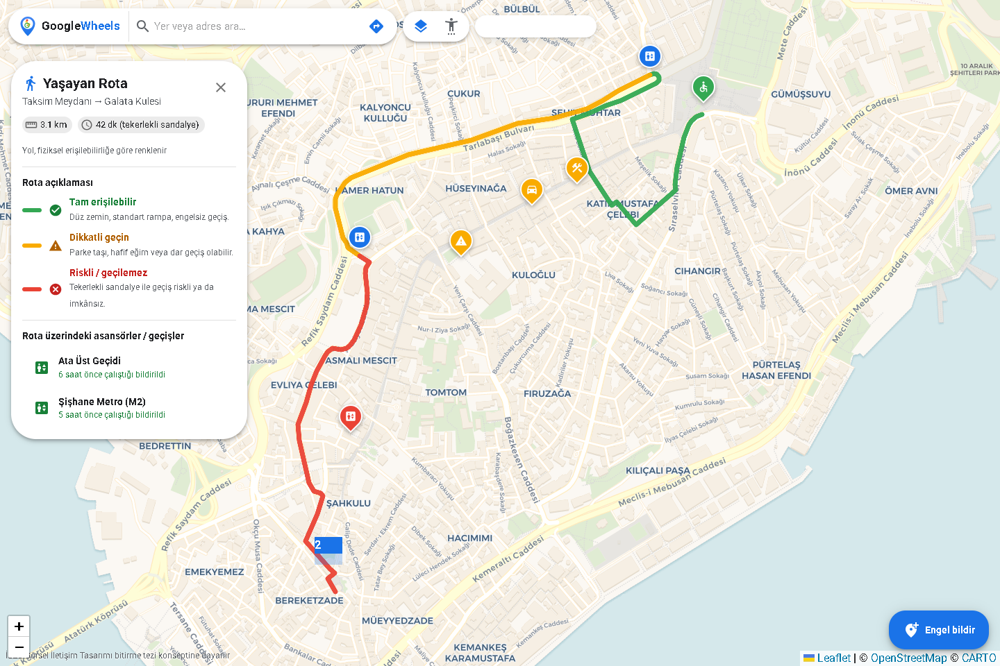
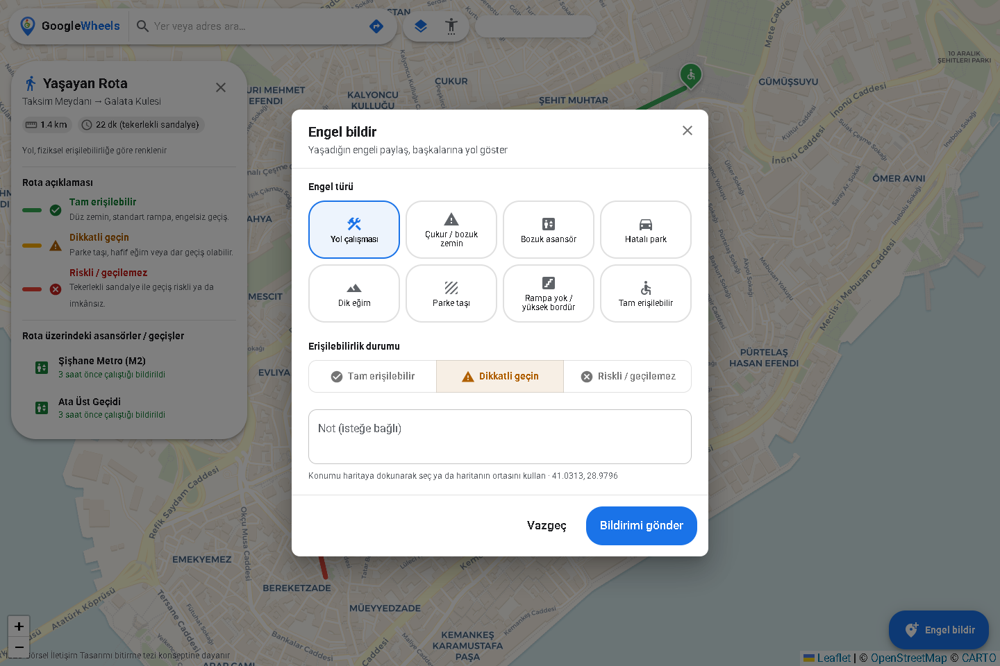
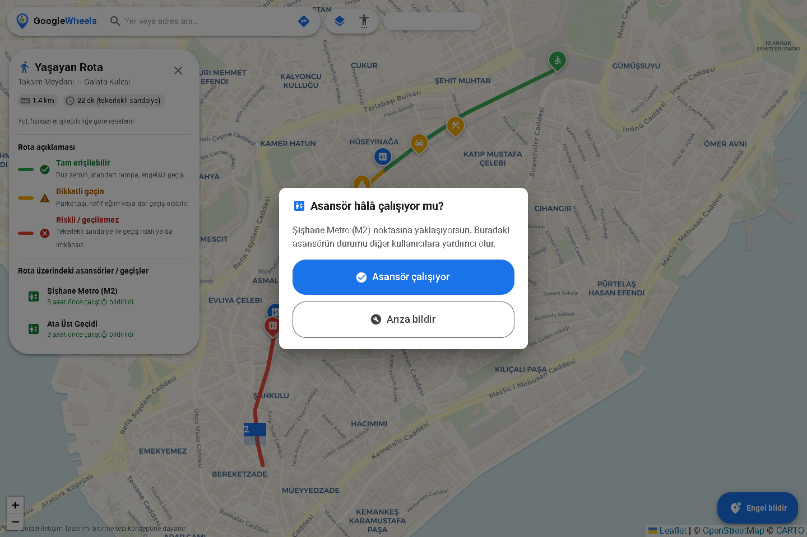

<div align="center">


# GoogleWheels

**Tekerlekli sandalye kullanıcıları için kalabalık-kaynaklı erişilebilirlik harita katmanı**
_A crowdsourced accessibility map layer for wheelchair users_

[🚀 **Canlı Demo / Live Demo**](https://bcolban.github.io/googlewheels/)


</div>

---

## 🎬 Rota oluşturma videosu / Demo

Adım adım nasıl rota oluşturulacağını gösteren kısa video:

<video src="https://github.com/bcolban/googlewheels/raw/main/docs/rota-olusturma.mp4" controls width="720"></video>

▶️ Oynatılmazsa indir/izle: **[docs/rota-olusturma.mp4](docs/rota-olusturma.mp4)**

---

## 🇹🇷 Türkçe

### Proje hakkında
GoogleWheels, İstanbul Sabahattin Zaim Üniversitesi Görsel İletişim Tasarımı bölümünde
hazırlanan **"Engelli Dostu Harita Arayüzü Eklentisi"** lisans bitirme tezi konseptinin
çalışan bir demo uygulamasıdır. Tez, tekerlekli sandalye kullanıcılarının kentsel mekânda
karşılaştığı "görünmez engelleri" (bozuk zemin, dik eğim, parke taşı, arızalı asansör,
hatalı park) **görselleştiren** ve kullanıcıların birbirine yardım ettiği bir **dayanışma
platformu** önerir.

Bu demo, o konsepti gerçekten denenebilir hâle getirir: harita üzerinde renk kodlu rotalar,
anlık engel bildirimi ve asansör doğrulama akışı çalışır durumdadır.

### Özellikler
- 📡 **Canlı konum** — "Konumumu göster" ile cihazının anlık konumu haritada mavi nokta +
  doğruluk halkasıyla canlı izlenir (HTTPS üzerinde, izinle).
- 🧭 **Kendi rotanı oluştur** — Adres/yer ara (OpenStreetMap Nominatim) veya konumunu kullan;
  başlangıç–varış seç, gerçek yaya yol ağını izleyen rota (OSRM) anında çizilir.
- 🟢🟡🔴 **Yaşayan Rotalar** — Rota çizgisi yolun fiziksel erişilebilirliğine göre renk değiştirir
  (yeşil: tam erişilebilir, sarı: dikkatli geç, kırmızı: riskli/geçilemez) — rota üzerindeki
  **engel bildirimlerine göre otomatik renklenir**. Renk asla tek sinyal değildir; her zaman
  ikon ve metinle birlikte sunulur.
- 📍 **Anlık Engel Bildirimi** — İkon setiyle engel türü (yol çalışması, çukur, bozuk asansör,
  hatalı park, dik eğim, parke taşı…) seçilir, kişisel not eklenir; bildirim haritaya düşer.
- 🛗 **Asansör Doğrulama (Yerinde Doğrulama)** — Asansörlü bir noktaya yaklaşınca _"Asansör hâlâ
  çalışıyor mu?"_ sorusu büyük butonlarla sorulur; sonraki kullanıcıya _"5 dk önce çalıştığı
  bildirildi"_ mikro-metniyle güven verir.
- 🤝 **Kalabalık-kaynaklı (crowdsourcing)** — Bildirimler Supabase üzerinden tüm kullanıcılarla
  paylaşılır. Supabase yapılandırılmamışsa uygulama otomatik olarak yerel demo verisine düşer.
- ♿ **Erişilebilir tasarım (WCAG 2.2)** — ≥44px dokunma hedefleri, yüksek kontrast modu, yazı
  boyutu ayarı, görünür klavye odağı, ARIA etiketleri, `prefers-reduced-motion` desteği.
- 🌐 **Çift dil** — Türkçe / İngilizce (otomatik algılama + manuel değiştirme).

### Ekran görüntüleri
| Karşılama | Yaşayan Rota |
|---|---|
|  |  |
| **Engel Bildirimi** | **Asansör Doğrulama** |
|  |  |

### Hızlı başlangıç
```bash
npm install
npm run dev      # http://localhost:5173
```
Uygulama, env tanımlı değilse **yerel demo verisiyle** çalışır — kurulum gerekmez.

### Canlı (paylaşımlı) veri için Supabase
1. [supabase.com](https://supabase.com)’da ücretsiz bir proje oluşturun.
2. `supabase/schema.sql` dosyasındaki tabloları ve RLS politikalarını çalıştırın.
3. `.env.example` dosyasını `.env.local` olarak kopyalayıp doldurun:
   ```env
   VITE_SUPABASE_URL=https://<proje>.supabase.co
   VITE_SUPABASE_ANON_KEY=sb_publishable_xxx
   ```
> Anon/publishable anahtar herkese açıktır (Row-Level Security ile korunur); istemciye gömülmesi güvenlidir.

### Teknoloji
React 19 · TypeScript · Vite · MUI v7 · Leaflet + react-leaflet · CARTO Voyager tiles
(ücretsiz, anahtarsız) · Supabase (opsiyonel) · react-i18next.

---

## 🇬🇧 English

### About
GoogleWheels is a working demo of a graduation-thesis concept (_"Accessibility-Friendly Map
Interface Plugin"_, ISZU Visual Communication Design). It **visualizes the invisible urban
barriers** wheelchair users face — broken surfaces, steep slopes, cobblestones, out-of-service
elevators, illegally parked cars — and turns the map into a **solidarity platform** where users
help each other.

### Features
- 📡 **Live location** — "Show my location" tracks your device's live position as a blue dot
  with an accuracy ring (over HTTPS, with permission).
- 🧭 **Create your own route** — search a place (OpenStreetMap Nominatim) or use your location,
  pick start & destination, and a real pedestrian route (OSRM) is drawn instantly.
- 🟢🟡🔴 **Living Routes** — the path is colored by physical accessibility, **automatically tinted
  by nearby obstacle reports**; color is never the only signal (always paired with icon + label).
- 📍 **Instant obstacle reporting** with an icon set + free-text note.
- 🛗 **Elevator verification flow** — _"Is the elevator still working?"_ with large buttons and a
  reassuring _"reported working 5 min ago"_ micro-copy.
- 🤝 **Crowdsourced** via Supabase, with automatic local-demo fallback.
- ♿ **Accessible by design (WCAG 2.2)** — ≥44px targets, high-contrast mode, font scaling,
  visible focus, ARIA labels, reduced-motion support.
- 🌐 **Bilingual** Turkish / English.

### Quick start
```bash
npm install
npm run dev
```
Works out of the box with **local demo data**. Add Supabase env vars (see `.env.example`) for
real shared crowdsourcing.

### Deploy
Pushing to `main` auto-deploys to GitHub Pages via [`.github/workflows/deploy.yml`](.github/workflows/deploy.yml).
Set `VITE_SUPABASE_URL` and `VITE_SUPABASE_ANON_KEY` as repository **secrets** for live data.

---

## Lisans / License
[MIT](LICENSE) · Harita verisi © OpenStreetMap katkıcıları, kartografya © CARTO.
Bu proje akademik bir tez konseptine dayanan, kâr amacı gütmeyen bir tasarım demosudur.
